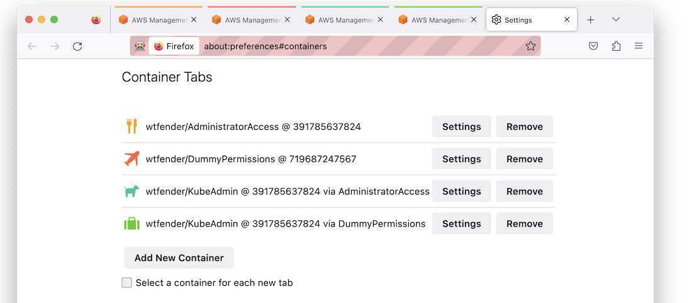
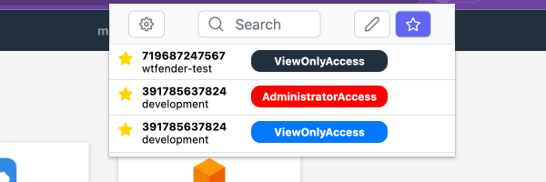
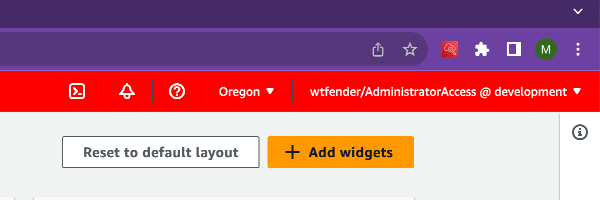
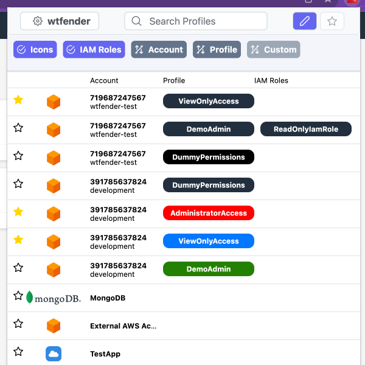
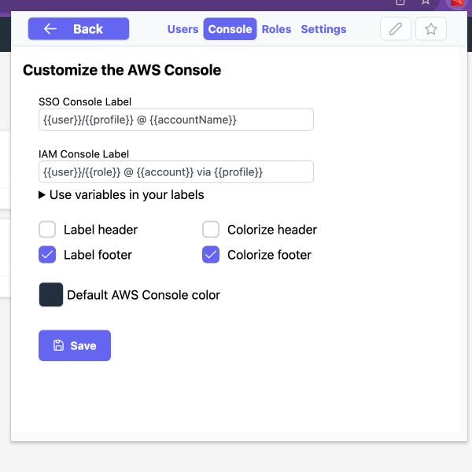
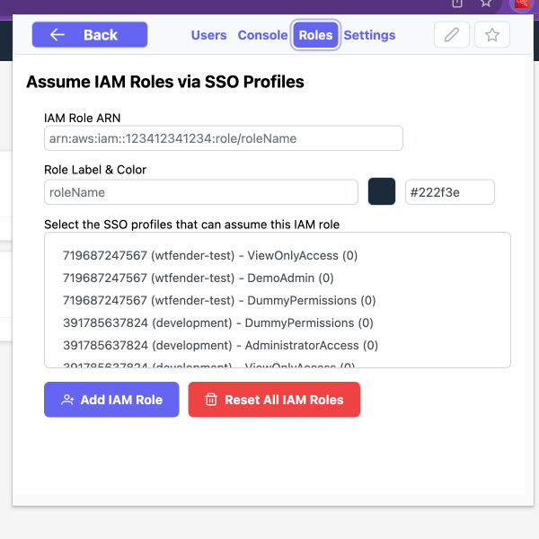

# aws-sso-extender

- [Install Chrome Extension](https://chrome.google.com/webstore/detail/aws-sso-extender/pojoaiboolahdaedebpjgnllehpofkep)
- [Install Firefox Add-on](https://addons.mozilla.org/en-US/firefox/addon/aws-sso-extender/)
- [Install Safari Extension](https://apps.apple.com/us/app/aws-sso-extender/id6450935274)

⭐ Quickly access your Favorite AWS SSO apps  
🎨 Customize your profiles, roles & AWS console  
🔑 Assume IAM roles from your SSO profiles  
🦊 Open the AWS console in Firefox Containers  

## Demo

https://github.com/WTFender/aws-sso-extender/assets/12001399/2fdc7459-7d76-4776-a96b-c151d8aa87ef

### Firefox Containers
Open the AWS Console in Firefox containers with IAM & SSO labels.  


### Screenshots






## Contribute

### Build & Test
Publishing to the Chrome & Firefox stores is quick & automated. Open a pull request to fix something.
```
npm install
npm run watch:chrome  # dev
npm run watch:firefox # dev
npm run build:chrome  # prod
npm run build:firefox # prod
```

#### Releases
1. Update `docs/CHANGELOG.md`
2. Update version in `package.json`
3. Open PR to `release` branch to build packages
4. Upload packages to publishers

[](https://github.com/WTFender/aws-sso-extender/actions/workflows/codeql.yml)  
[](https://github.com/WTFender/aws-sso-extender/actions/workflows/build.yml)  
[](https://github.com/WTFender/aws-sso-extender/actions/workflows/release.yml)  
[](https://github.com/WTFender/aws-sso-extender/actions/workflows/publish_firefox.yml)  
[](https://github.com/WTFender/aws-sso-extender/actions/workflows/publish_chrome.yml)  
